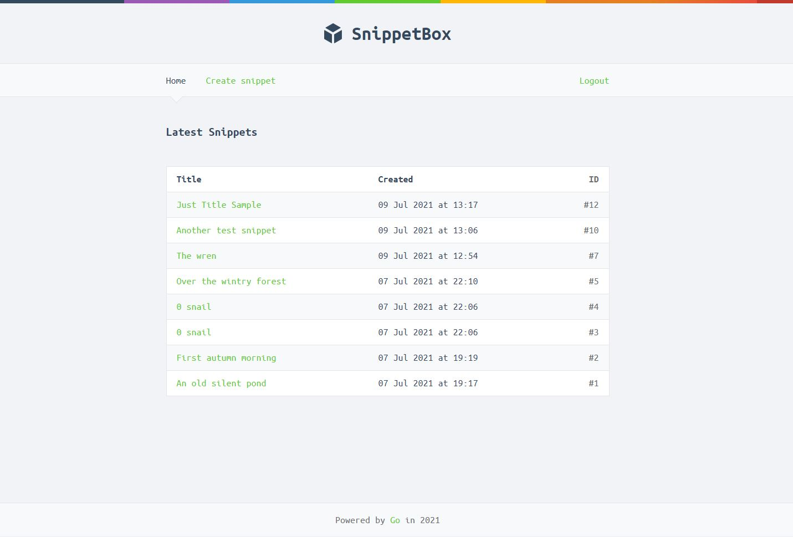

# Snippet-box
It's a web application that allows the users to register/login and add text snippets.

Project from the book ["Let's Go! Learn to build professional web applications with Go"](https://lets-go.alexedwards.net/) by Alex Edwards

### Features
- authentication & authorization
- custom middleware
- RESTful routing
- MySQL
- TLS web server
- golang templates
- CSRF protection
- unit testing

### Development

##### Run the `go run ./cmd/web` command to get started.